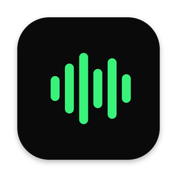
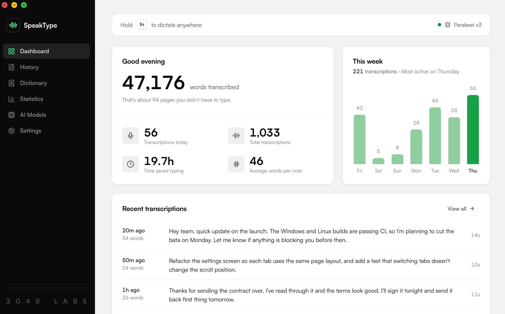

# SpeakType

**Talk instead of type, in any app. Free, open source, and 100% on your computer.**

<b>Hold <kbd>fn</kbd>, talk, let go.</b> Your words land wherever your cursor is, in any app.

## Why SpeakType

|  | SpeakType | Cloud dictation |
| --- | --- | --- |
| **Price** | Free, no limits | Monthly subscription |
| **Your voice** | Never leaves your computer | Uploaded to their servers |
| **Works offline** | ✅ | ❌ |
| **Account** | None | Required |
| **Source code** | Open, MIT licensed | Closed |

<table>
<tr>
<td width="33%" valign="top">

**⚡ Fast** 
Parakeet turns a 35-second ramble into punctuated text in under two seconds.

</td>
<td width="33%" valign="top">

**🪶 Tiny** 
15 MB to install, about 285 MB of memory with a model loaded, 0% CPU while idle.

</td>
<td width="33%" valign="top">

**🌍 Multilingual** 
25 European languages with Parakeet, 99 with Whisper.

</td>
</tr>
<tr>
<td valign="top">

**⌨️ Any app** 
Pastes wherever you're typing, then puts your clipboard back.

</td>
<td valign="top">

**📖 Spelled right** 
A dictionary for names and jargon. Filler words like "um" are removed.

</td>
<td valign="top">

**🕘 History and stats** 
Replay and copy past dictations, and see the typing time you've saved.

</td>
</tr>
</table>

## Download

| macOS 13+ (Apple Silicon) | Windows 10 and 11 | Linux |
| :---: | :---: | :---: |
| [`.dmg`](https://github.com/karansinghgit/speaktype/releases?q=v2&expanded=true) | [`.exe`](https://github.com/karansinghgit/speaktype/releases?q=v2&expanded=true) | [`.deb`](https://github.com/karansinghgit/speaktype/releases?q=v2&expanded=true) · [`.AppImage`](https://github.com/karansinghgit/speaktype/releases?q=v2&expanded=true) |

<b>First launch</b>

 

The builds aren't signed by Apple or Microsoft yet, so opening SpeakType the first time takes one extra step.

- **macOS:** if it says Apple couldn't check the app, open System Settings → Privacy & Security and click **Open Anyway**.
- **Windows:** on the SmartScreen prompt, click **More info**, then **Run anyway**.

Then allow microphone and accessibility access, pick the model SpeakType recommends, and hold your hotkey to talk.

SpeakType 2 is new, so please [open an issue](https://github.com/karansinghgit/speaktype/issues) if something's off. Looking for the old Mac-only app? [SpeakType 1.3](https://github.com/karansinghgit/speaktype/releases/tag/v1.3.0) is still here.

## What's next

- **AI cleanup, still local:** tidy up and format what you said with a model on your computer.
- **iOS and Android:** a SpeakType keyboard, with optional sync between your devices.
- **Signed builds** for macOS and Windows.

## Contribute

The repo is new and the codebase is small, so it's a good time to jump in.

| Area | Stack | What's there |
| --- | --- | --- |
| **Frontend** | React, TypeScript | App screens, the recorder pill, the menu bar panel, and screens for upcoming features |
| **App core** | Rust | Audio, speech models, hotkeys and pasting on each system, and local post-processing models next |
| **Product** | | Feedback, ideas and design polish |
| **Mobile** | React Native | Coming soon: the iOS and Android keyboard and sync |

Don't let Rust put you off. There's no legacy code to wade through, which makes this a great place to learn it. Windows and Linux support especially could use people who use them every day.

[Open an issue](https://github.com/karansinghgit/speaktype/issues) with what you'd like to pick up, and we'll help you get started.

---

**If SpeakType saves you some typing, a star helps other people find it.**

Speech recognition by [OpenAI Whisper](https://github.com/openai/whisper) and [NVIDIA Parakeet](https://huggingface.co/nvidia/parakeet-tdt-0.6b-v3), running on [whisper.cpp](https://github.com/ggml-org/whisper.cpp), [ONNX Runtime](https://onnxruntime.ai), [WhisperKit](https://github.com/argmaxinc/WhisperKit) and [FluidAudio](https://github.com/FluidInference/FluidAudio). [MIT licensed](LICENSE).
