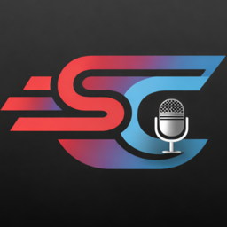

<div align="center">



# SpeakType

**Talk instead of type, in any app. Free, open source, and 100% on your computer.**

[](https://github.com/karansinghgit/speaktype/releases/latest)
[](https://github.com/karansinghgit/speaktype/releases)

[](https://github.com/karansinghgit/speaktype/stargazers)
[](https://github.com/karansinghgit/speaktype/releases)
[](LICENSE)


</div>

Hold <kbd>fn</kbd>, say what you want to write, and let go. Your words appear wherever your cursor is: Slack, email, your editor, a terminal, a prompt box. Cloud dictation apps send your voice to a server and charge a subscription for it. SpeakType runs the speech model on your own machine, so it costs nothing, works offline, and nothing you say ever leaves your computer.

## Why people switch to SpeakType

**🔒 Your voice stays on your computer.** No account, no cloud, no tracking. Pull the network cable and it still works.

**⚡ Faster than you can reach the keyboard.** Parakeet turns a 35-second ramble into punctuated text in about a second on Apple Silicon, and models stay warm in the background, so there's no waiting to start.

**🆓 Free. Actually free.** No trial, no word limits, no monthly plan. MIT licensed, so you can read every line.

**🌍 25+ languages.** Parakeet v3 covers 25 European languages, and Whisper covers 99.

**⌨️ Works in every app.** It pastes into whatever has focus, then puts your clipboard back the way it was.

## What's inside

- **Hold to talk or toggle.** Use <kbd>fn</kbd>, a single modifier like right <kbd>⌘</kbd>, or any shortcut you like.
- **The best open models.** NVIDIA Parakeet v2 and v3 for speed, and OpenAI Whisper from Tiny to Large v3 Turbo for accuracy. SpeakType recommends one for your hardware.
- **Neural Engine acceleration** for Whisper on Apple Silicon.
- **A dictionary** for names, jargon and anything else it keeps getting wrong.
- **Cleaner text:** filler words like "um" and "uh" are removed, and punctuation is tidied up.
- **History with playback.** Search past dictations, copy them again, and replay the recording.
- **Stats** on words dictated and typing time saved.
- **A recorder pill** that shows a live waveform while you talk, placed wherever you want it on screen.

## Get started

1. **[Download SpeakType](https://github.com/karansinghgit/speaktype/releases/latest)**, open the `.dmg` and drag SpeakType to Applications.
2. Allow microphone and accessibility access when asked. SpeakType needs them to hear you and to paste.
3. Pick a model. SpeakType suggests one that runs well on your Mac.
4. Hold <kbd>fn</kbd> and start talking.

Requires macOS 13 or later. Apple Silicon is recommended.

## Coming next: SpeakType 2

SpeakType is being rebuilt as one app for **macOS, Windows and Linux**, with the same local models on every platform.

- **About 15 MB to install,** down from 66 MB.
- **Light on memory:** about 285 MB with a model loaded, and 0% CPU while idle.
- **A new design,** with a menu bar panel for quick switches and your latest dictations.

Early builds for all three systems are on the [releases page](https://github.com/karansinghgit/speaktype/releases), marked as pre-releases. Expect rough edges, and please [open an issue](https://github.com/karansinghgit/speaktype/issues) when you find one.

## Build from source

```bash
git clone https://github.com/karansinghgit/speaktype.git
cd speaktype
make build && make run
```

`make test` runs the tests and `make dmg` builds the installer.

## Contributing

Bug reports, ideas and pull requests are all welcome. For anything bigger than a small fix, open an issue first so we can talk it through.

## Credits

Speech recognition by [OpenAI Whisper](https://github.com/openai/whisper) through [WhisperKit](https://github.com/argmaxinc/WhisperKit), and [NVIDIA Parakeet](https://huggingface.co/nvidia/parakeet-tdt-0.6b-v3) through [FluidAudio](https://github.com/FluidInference/FluidAudio). Global shortcuts by [KeyboardShortcuts](https://github.com/sindresorhus/KeyboardShortcuts).

## License

[MIT](LICENSE). Made by [2048 Labs](https://tryspeaktype.com).

<div align="center">

If SpeakType saves you some typing, a ⭐ helps other people find it.

</div>
